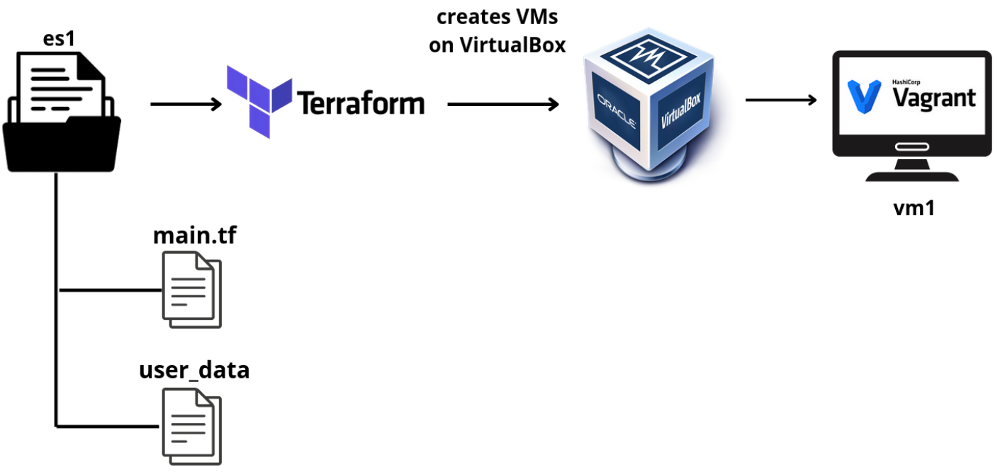
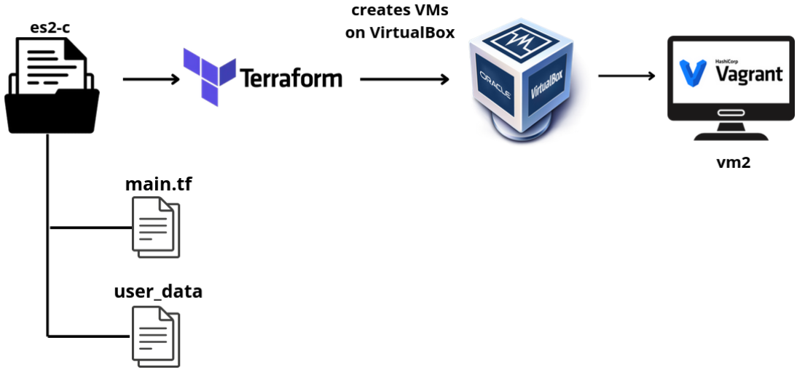
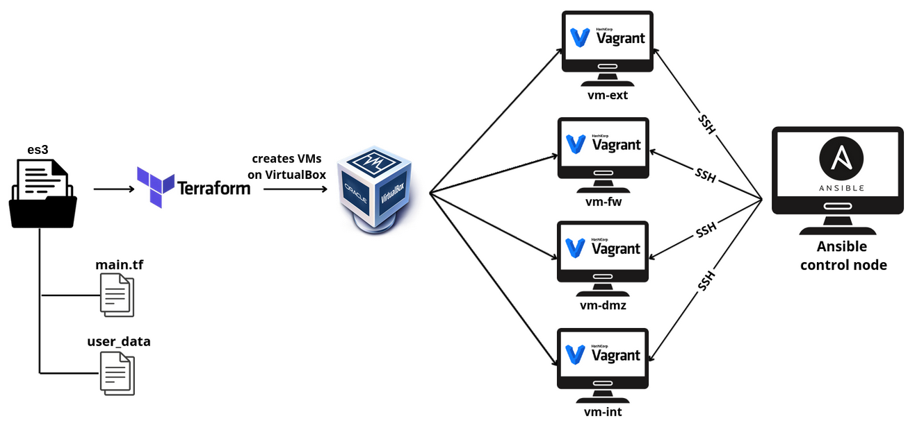

# Terraform-lab
The Terraform Lab is set up on Ubuntu 22.04 using Terraform v1.11.2. It utilizes the VirtualBox provider from Terraform (terra-farm v0.2.2-alpha.1 a community-supported VirtualBox provider) 
and runs on VirtualBox 7.0.24 r167081, using the Vagrant box: jammy-server-cloudimg-amd64-vagrant.box (20230607.0.1)

Terraform Lab has been adjusted to be more **cross-platform**, aiming to improve compatibility with **Windows, macOS, and Linux**. 
While some adaptations have been made, users may still need to fine-tune configurations depending on their operating system.

## Exercise 1: create a VM using Terraform

## Exercise 2: create a VM and manage its network interfaces
- **2a.** Manual configuration of network interfaces using the VirtualBox GUI
- **2b.** Manual configuration of network interfaces via the command line using VBoxManage
- **2c.** Automated creation of a VM with multiple network interfaces using Terraform

## Exercise 3: create and configure a 3-Legged Firewall using Terraform and Ansible
- **3a.** Create a complex network topology (3-Legged Firewall) using Terraform to create VMs on VirtualBox
- **3b.** Use Ansible to manage network and configure the created VMs

