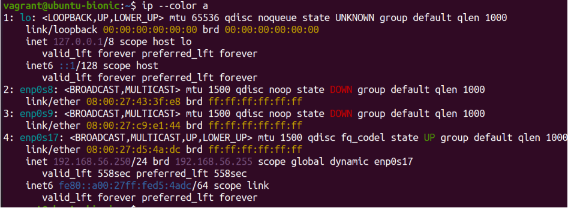
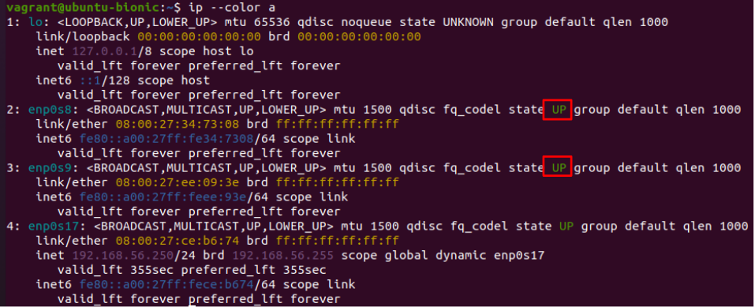
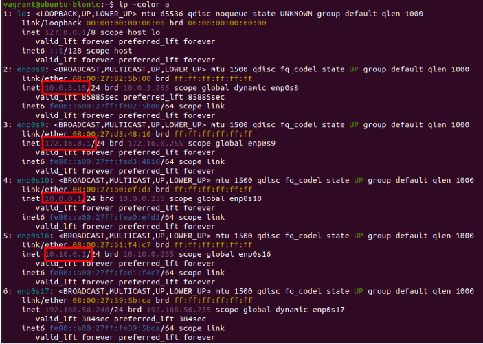
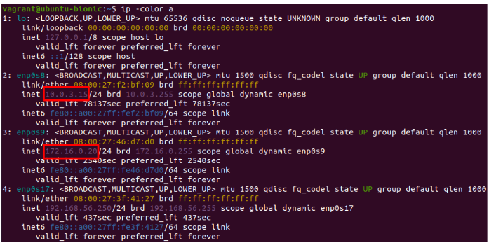

## Exercise 3b: Configure the 3-Legged Firewall topology using Ansible

Move to the directory /etc/ansible:
```bash
cd /etc/ansible
```

### Configure ansible.cfg file

Edit the ansible.cfg file:
```bash
sudo nano ansible.cfg
```
```bash
[defaults]
inventory = /etc/ansible/hosts
host_key_checking = False
```

### Configure hosts file
Edit the hosts file:
```bash
sudo nano hosts
```
Add the following configuration, **replacing the IP addresses and variables as needed to match your VMs setup**:
```bash
[all]
vm-ext ansible_host=192.168.56.250 ansible_user=vagrant ansible_ssh_private_key_file=/home/samanta/.ssh/id_rsa ansible_sudo_pass=vagrant
vm-fw ansible_host=192.168.56.246 ansible_user=vagrant ansible_ssh_private_key_file=/home/samanta/.ssh/id_rsa ansible_sudo_pass=vagrant
vm-dmz ansible_host=192.168.56.247 ansible_user=vagrant ansible_ssh_private_key_file=/home/samanta/.ssh/id_rsa ansible_sudo_pass=vagrant
vm-int ansible_host=192.168.56.248 ansible_user=vagrant ansible_ssh_private_key_file=/home/samanta/.ssh/id_rsa ansible_sudo_pass=vagrant
```


Copy the ssh key with the command:
```bash
ssh-copy-id vagrant@<IP_VM-ext>
```
**Replace <IP_VM-ext> with the actual IP address of your VM**
**Repeat this command for each VM you have created, replacing the IP accordingly.** This step allows Ansible to connect to the remote nodes without requiring a password each time

In case you receive the "permission denied (publickey)" error, run the following commands **from the terminal of the VM you have created using Terraform** to enable SSH connection using PasswordAuthentication:
1. Edit the sshd_config file:
```bash
sudo nano /etc/ssh/sshd_config
```
**Warning:** the keyboard is set to “us”, therefore:
- / corresponds to - on the “it” keyboard
- _ corresponds to ? on the “it” keyboard

2. Open the sshd_config file using a text editor, for this example nano. Press the key combination Ctrl + W and a search bar labeled "Search" will appear at the bottom of the page
Type PasswordAuthentication in the search bar and press “Enter”

3. The cursor will move to the first occurrence of “PasswordAuthentication” delete no and write yes

4. Press Ctrl + X to close the file. This will bring up a white bar at the bottom of the file asking whether to save the changes or not. Press y to save and then press Enter

5.	Restart the SSH service with the command:
```bash
sudo systemctl restart sshd
```

Then, from the terminal of the Ansible Control Node, enter again:
```bash
ssh-copy-id vagrant@<IP_VM-ext>
```

Repeat this operation for all the VMs

Once you've copied the SSH keys to all VMs, verify the configuration by running the following command from the terminal of your Ansible Control Node:
```bash
ansible all -m ping
```
If everything is set up correctly, this command should return a "pong" response from all the VMs.

By connecting in SSH to a controlled VM, you can check the status of the network interfaces that were previously created
As you can see, the network interfaces have been created, but they are in a "DOWN" state, meaning they are not active (only host-only UP)



### Create the role "enable_network_interfaces"
From the terminal of the Ansible Control Node, move to the directory roles:
```bash
cd /etc/ansible/roles
```
Then create the role using the command:
```bash
sudo ansible-galaxy init enable_network_interfaces
```
Move to the directory tasks and edit the main.yml file:
```bash
sudo nano tasks/main.yml
```
And enter:
```bash
---
- name: "Gather network interfaces facts"
  ansible.builtin.setup:
    filter: ansible_interfaces
  register: network_interfaces

- name: "Bring up all network interfaces"
  ansible.builtin.command:
    cmd: "ip link set {{ item }} up"
  loop: "{{ network_interfaces.ansible_facts.ansible_interfaces }}"
  when: item != 'lo'
  ignore_errors: yes
```
Then move to the directory playbooks:
```bash
cd ../../playbooks/
```
In case you have not create it, you can do it using:
```bash
cd ../../../
sudo mkdir playbooks
```
And create the playbook: "interfaces_up.yml" using the command:
```bash
sudo nano interfaces_up.yml
```
```bash
---
- name: "Enable all network interfaces"
  hosts: all
  become: yes
  gather_facts: yes

  roles:
    - enable_network_interfaces
```
Run the playbook, using the command:
```bash
ansible-playbook interfaces_up.yml
```
As a result of the playbook, by connecting in SSH to the target VMs it is possible to see that the network interfaces are now all up


### 6. Create the role "static_ip_config"
From the terminal of the Ansible Control Node, move to the directory roles:
```bash
cd ../../../roles
```
Then create the role using the command:
```bash
sudo ansible-galaxy init static_ip_config
```
Move to the directory tasks and edit the main.yml file:
```bash
sudo nano tasks/main.yml
```
Add the following configuration:
```bash
---
- name: "Enable IP forwarding"
  ansible.builtin.sysctl:
    name: net.ipv4.ip_forward
    value: "1"
    state: present
    reload: yes
  notify: Apply sysctl changes

- name: "Copy netplan configuration file"
  ansible.builtin.copy:
    src: /etc/ansible/roles/static_ip_config/files/network-config.yaml
    dest: /etc/netplan/01-netcfg.yaml
    owner: root
    group: root
    mode: '0644'

- name: "Apply netplan configuration"
  ansible.builtin.command:
    cmd: netplan apply
  notify: Restart networking
```
Move to the directory handlers and edit the main.yml file:
```bash
cd ../handlers
sudo nano main.yml
```
Add the following configuration:
```bash
---
- name: "Apply sysctl changes"
  ansible.builtin.command:
    cmd: sysctl -p

- name: "Restart networking"
  ansible.builtin.service:
    name: systemd-networkd
    state: restarted
```
Move to the directory files and create the network-config.yaml file:
```bash
cd ../files
sudo nano network-config.yaml 
```
Add the following configuration:
```bash
network:
  version: 2
  renderer: networkd
  ethernets:
    enp0s8:
      dhcp4: yes
    enp0s9:
      dhcp4: no
      addresses: [172.16.0.1/24]
    enp0s10:
      dhcp4: no
      addresses: [10.0.0.1/24]
    enp0s16:
      dhcp4: no
      addresses: [10.10.0.1/24]
```
Move to the directory playbooks and create the playbook static_ip_fw.yml using the command:
```bash
cd ../../../playbooks
sudo nano static_ip_fw.yml
```
Add the following configuration:
```bash
---
- name: "Configure static IP on vm-fw"
  hosts: vm-fw
  become: yes
  roles:
    - static_ip_config
```
Run the playbook, using the command:
```bash
ansible-playbook static_ip_fw.yml
```
As a result of the playbook, by connecting in SSH to vm-fw it is possible to see that the IP addresses of all network interfaces have been configured




### Create the role "isc-dhcp"
From the terminal of the Ansible Control Node, move to the directory roles:
```bash
cd ../../../roles
```
Then create the role using the command:
```bash
sudo ansible-galaxy init isc-dhcp
```
Move to the directory tasks and edit the main.yml file:
```bash
sudo nano tasks/main.yml
```
Add the following configuration:
```bash
---
- name: "Install ISC DHCP Server"
  ansible.builtin.apt:
    name: isc-dhcp-server
    state: present
    update_cache: yes

- name: "Copy DHCP configuration file"
  ansible.builtin.copy:
    src: /etc/ansible/roles/isc-dhcp/files/dhcpd.conf
    dest: /etc/dhcp/dhcpd.conf
    owner: root
    group: root
    mode: '0644'
  notify: Restart DHCP Server

- name: "Ensure DHCP service is enabled and running"
  ansible.builtin.service:
    name: isc-dhcp-server
    state: started
    enabled: yes
```
Move to the directory handlers and edit the main.yml file:
```bash
cd ../handlers
sudo nano main.yml
```
Add the following configuration:
```bash
---
- name: "Restart DHCP Server"
  ansible.builtin.service:
    name: isc-dhcp-server
    state: restarted
```
Move to the directory files and create the network-config.yaml file:
```bash
cd ../files
sudo nano dhcpd.conf
```
Add the following configuration:
```bash
default-lease-time 3600;
max-lease-time 7200;

subnet 172.16.0.0 netmask 255.255.255.0 {
  range 172.16.0.20 172.16.0.254;
  option domain-name-servers 8.8.8.8, 8.8.4.4;
  option subnet-mask 255.255.255.0;
  option routers 172.16.0.1;
  option broadcast-address 172.16.0.255;
  default-lease-time 3600;
  max-lease-time 7200;
  interface enp0s9;
}


subnet 10.0.0.0 netmask 255.255.255.0 {
  range 10.0.0.20 10.0.0.254;
  option domain-name-servers 8.8.8.8, 8.8.4.4;
  option subnet-mask 255.255.255.0;
  option routers 10.0.0.1;
  option broadcast-address 10.0.0.255;
  default-lease-time 3600;
  max-lease-time 7200;
  interface enp0s10;
}

subnet 10.10.0.0 netmask 255.255.255.0 {
  range 10.10.0.20 10.10.0.254;
  option domain-name-servers 8.8.8.8, 8.8.4.4;
  option subnet-mask 255.255.255.0;
  option routers 10.10.0.1;
  option broadcast-address 10.10.0.255;
  default-lease-time 3600;
  max-lease-time 7200;
  interface enp0s16;
}
```
Move to the directory playbooks and create the dhcp_server.yml file:
```bash
cd ../../../playbooks
sudo nano dhcp_server.yml
```
Add the following configuration:
```bash
---
- name: Install and configure ISC DHCP Server
  hosts: vm-fw
  become: yes
  roles:
    - isc-dhcp
```
Then run the playbook:
```bash
ansible-playbook dhcp_server.yml
```
This playbook installs a isc dhcp server on the vm-fw that is now ready to assign IP addresses to the VMs

### If you are using VirtualBox version older than 7.0.24, you may experience issues due to missing network connectivity

To resolve this, you need to create a new NAT network. Follow these steps:
1. Open Tools in VirtualBox
2. Click on the menu icon on the right to open the sliding menu
3. Select NAT Networks from the menù on the top
4. Click Create
5. In the NAT Networks section, ensure that Enable DHCP is checked

Once the NAT network is created, update the network adapter settings for each virtual machine:
1. Open the settings of the VM
2. Navigate to the Network section
3. Locate the adapter currently set to NAT and change to NAT Network
4. Write the name of the NAT network you just created

This should restore network connectivity for your virtual machines

### Create the role "netplan_config"
From the terminal of the Ansible Control Node, move to the directory roles:
```bash
cd ../roles
```
Create the role netplan_config:
```bash
sudo ansible-galaxy init netplan_config
```
Move to the directory tasks and edit the main.yml file:
```bash
cd netplan_config/tasks
sudo nano main.yml
```
Add the following configuration:
```bash
---
- name: "Copy netplan configuration to the VM"
  ansible.builtin.copy:
    src: /etc/ansible/roles/netplan_config/files/00-cloud-init.yaml
    dest: /etc/netplan/00-cloud-init.yaml
    owner: root
    group: root
    mode: '0644'
  notify:
    - Apply netplan configuration
```
Move to the directory handlers and edit the main.yml file:
```bash
cd ../handlers
sudo nano main.yml
```
Add the following configuration:
```bash
---
- name: "Apply netplan configuration"
  ansible.builtin.command: netplan apply
```
Move to the directory files and edit the 00-cloud-init.yaml file:
```bash
cd ../files
sudo nano 00-cloud-init.yaml
```
Add the following configuration:
```bash
network:
  version: 2
  renderer: networkd
  ethernets:
    enp0s8:
      dhcp4: true
    enp0s9:
      dhcp4: true
    enp0s10:
      dhcp4: true
    enp0s16:
      dhcp4: true
```

Move to the directory playbooks and create the apply_netplan.yml playbook:
```bash
cd ../../../playbooks
sudo nano apply_netplan.yml
```
Add the following configuration:
```bash
---
- name: "Apply Netplan configuration to multiple VMs"
  hosts:
    - vm-int
    - vm-ext
    - vm-dmz
  become: yes
  roles:
    - netplan_config
```
Then run the playbook:
```bash
ansible-playbook apply_netplan.yml
```
From Ansible Control Node terminal connect to the VMs, in this example vm-ext, via SSH:
```bash
ssh vagrant@192.168.56.250
```
(Note. replace 192.168.56.250 with the actual IP address of your vm-fw)
Once inside the vm-fw terminal, use the command:
```bash
ip -color a
```
that will display the IP addresses configured on the VM


### Create the role "firewall"
From the terminal of the Ansible Control Node, move to the directory roles:
```bash
cd ../roles
```
Create the role firewall:
```bash
sudo ansible-galaxy init firewall
```
Move to the directory tasks and edit the main.yml file:
```bash
cd firewall/tasks
sudo nano main.yml
```
Add the following configuration:
```bash
---
- name: "Enable IP forwarding"
  ansible.builtin.sysctl:
    name: net.ipv4.ip_forward
    value: '1'
    state: present
    sysctl_set: yes
    reload: yes

- name: "Ensure iptables-persistent is installed"
  ansible.builtin.apt:
    name: iptables-persistent
    state: present

- name: "Ensure /etc/iptables directory exists"
  ansible.builtin.file:
    path: /etc/iptables
    state: directory
    mode: '0755'

- name: "Ensure iptables rules file exists"
  ansible.builtin.file:
    path: /etc/iptables/rules.v4
    state: touch
    mode: '0644'

- name: "Copy iptables script to firewall"
  ansible.builtin.copy:
    src: /etc/ansible/roles/firewall/files/iptables_rules.sh
    dest: /root/iptables_rules.sh
    mode: '0755'

- name: "Apply iptables rules"
  ansible.builtin.command: bash /root/iptables_rules.sh
  notify: Save iptables rules
```
Move to the directory handlers and edit the main.yml file:
```bash
cd ../handlers
sudo nano main.yml
```
Add the following configuration:
```bash
---
- name: "Save iptables rules"
  ansible.builtin.command: iptables-save
  register: iptables_output

- name: "Write iptables rules to file"
  ansible.builtin.copy:
    content: "{{ iptables_output.stdout }}"
    dest: /etc/iptables/rules.v4
    mode: '0644'
```
Move to the directory files and edit the iptables_rules.sh file:
```bash
cd ../files
sudo nano iptables_rules.sh
```
Add the following configuration:
```bash
!/bin/bash
# Reset delle regole di iptables
iptables -F
iptables -X
iptables -t nat -F
iptables -t mangle -F
iptables -P INPUT DROP
iptables -P FORWARD DROP
iptables -P OUTPUT ACCEPT

# Definizione delle interfacce
INTERNET="enp0s8"   # Interfaccia NAT verso Internet
EXT_NET="enp0s9"    # Interfaccia subnet_a (rete esterna)
INT_NET="enp0s10"   # Interfaccia subnet_b (rete interna)
DMZ_NET="enp0s16"   # Interfaccia subnet_dmz (DMZ)
MGMT_NET="enp0s17"  # Interfaccia hostonly (management)

# Consenti traffico locale su loopback
iptables -A INPUT -i lo -j ACCEPT
iptables -A OUTPUT -o lo -j ACCEPT

# Consenti SSH da rete di gestione (per Ansible)
iptables -A INPUT -i $MGMT_NET -p tcp --dport 22 -j ACCEPT
iptables -A OUTPUT -o $MGMT_NET -p tcp --sport 22 -m conntrack --ctstate ESTABLISHED -j ACCE>

# Consenti SSH da rete interna
iptables -A INPUT -i $INT_NET -p tcp --dport 22 -j ACCEPT
iptables -A OUTPUT -o $INT_NET -p tcp --sport 22 -m conntrack --ctstate ESTABLISHED -j ACCEPT

# Connessioni stabilite e correlate
iptables -A INPUT -m conntrack --ctstate ESTABLISHED,RELATED -j ACCEPT
iptables -A FORWARD -m conntrack --ctstate ESTABLISHED,RELATED -j ACCEPT

# Consenti ICMP (ping) su tutte le interfacce
iptables -A INPUT -p icmp -j ACCEPT
iptables -A OUTPUT -p icmp -j ACCEPT
iptables -A FORWARD -p icmp -j ACCEPT

# Regole per la DMZ
# Consenti accesso HTTP/HTTPS dalla rete esterna verso DMZ
iptables -A FORWARD -i $EXT_NET -o $DMZ_NET -p tcp --dport 80 -j ACCEPT
iptables -A FORWARD -i $EXT_NET -o $DMZ_NET -p tcp --dport 443 -j ACCEPT
# Consenti accesso HTTP/HTTPS dalla rete interna verso DMZ
iptables -A FORWARD -i $INT_NET -o $DMZ_NET -p tcp --dport 80 -j ACCEPT
iptables -A FORWARD -i $INT_NET -o $DMZ_NET -p tcp --dport 443 -j ACCEPT

# Blocca traffico diretto tra rete esterna e interna
iptables -A FORWARD -i $EXT_NET -o $INT_NET -j DROP
iptables -A FORWARD -i $INT_NET -o $EXT_NET -j DROP

# Consenti traffico da DMZ verso Internet (solo HTTP/HTTPS)
iptables -A FORWARD -i $DMZ_NET -o $INTERNET -p tcp --dport 80 -j ACCEPT
iptables -A FORWARD -i $DMZ_NET -o $INTERNET -p tcp --dport 443 -j ACCEPT

# Consenti traffico da rete interna verso Internet
iptables -A FORWARD -i $INT_NET -o $INTERNET -j ACCEPT

# Traffico DNS
iptables -A INPUT -p udp --sport 53 -j ACCEPT
iptables -A INPUT -p tcp --sport 53 -j ACCEPT
iptables -A OUTPUT -p udp --dport 53 -j ACCEPT
iptables -A OUTPUT -p tcp --dport 53 -j ACCEPT
iptables -A FORWARD -p udp --dport 53 -j ACCEPT
iptables -A FORWARD -p tcp --dport 53 -j ACCEPT
iptables -A FORWARD -p udp --sport 53 -j ACCEPT
iptables -A FORWARD -p tcp --sport 53 -j ACCEPT

# ABILITA NAT per accesso a Internet
iptables -t nat -A POSTROUTING -o $INTERNET -j MASQUERADE

# Log dei pacchetti scartati
iptables -A INPUT -j LOG --log-prefix "IPTables-Input-Dropped: " --log-level 4
iptables -A FORWARD -j LOG --log-prefix "IPTables-Forward-Dropped: " --log-level 4

# SALVA LE REGOLE
mkdir -p /etc/iptables
iptables-save > /etc/iptables/rules.v
```
Move to the directory playbooks and create the firewall_setup.yml file:
```bash
cd ../../../playbooks
sudo nano firewall_setup.yml
```
Add the following configuration:
```bash
---
- name: "Configure 3-legged Firewall"
  hosts: vm-fw
  become: yes
  roles:
    - firewall
```

Then run the playbook, that configures the firewall rules on vm-fw:
```bash
ansible-playbook firewall_setup.yml
```


